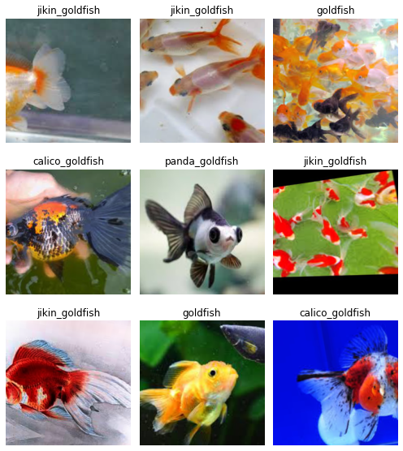

# HW 6

**Objectives**: 
1. Build a numpy MNIST classifier with autograd. Build an CNN based image classifier (at least 3 - 5 categories) from a custom data set you acquire from images.google.com
**Build with**:
* _**Pure Numpy (with unit tests)**_ (1) 

2. Build a CNN based image classifier (at least 3 - 5 categories) from a custom data set you acquire from images.google.com
**Build with**:
* _**Keras, Tensorflow**_ (2a) 
* _**Pytorch Lightning**_ (2b) 

**Google Image Custom Dataset**:
Followed this [tutoral](https://colab.research.google.com/github/fastai/course-v3/blob/master/nbs/dl1/lesson2-download.ipynb#scrollTo=UxMJK_UJbIAO) from fastai vision to download google images (512 in total) of 4 different types of goldfish (Regular, Panda Telescope, Calico, Jikin). 

Reference/Modified code from the following notebooks: 
* https://keras.io/examples/vision/image_classification_from_scratch/
https://developers.google.com/codelabs/tensorflow-4-cnns?
* https://learnopencv.com/getting-started-with-pytorch-lightning/
* https://colab.sandbox.google.com/github/omerbsezer/Fast-Pytorch/blob/master/Learning_Pytorch/Pytorch_Playground.ipynb
* https://towardsdatascience.com/from-pytorch-to-pytorch-lightning-a-gentle-introduction-b371b7caaf09
* https://colab.research.google.com/github/omerbsezer/Fast-Pytorch/blob/master/Learning_Pytorch/Improved_CNN_Mnist.ipynb#scrollTo=wxZyoq64hj-K
